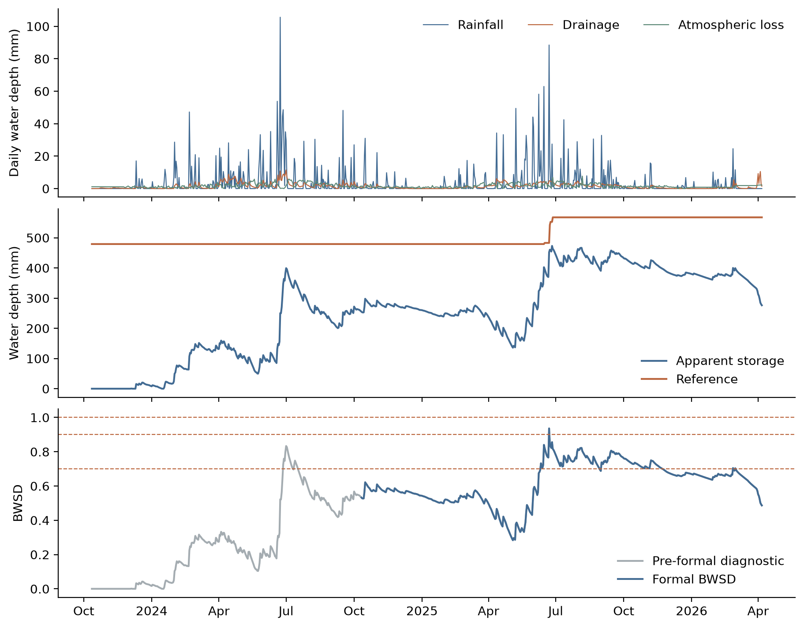

# BWSD · Fengshuwan

**Sequential apparent-storage assessment for risk-informed debris-flow warning support.**

[](https://github.com/zjusuge/bwsd-fengshuwan-case/actions/workflows/tests.yml)
[](https://doi.org/10.5281/zenodo.20068173)

BWSD reconstructs apparent storage from rainfall, channel drainage and an evaporation-based atmospheric water-loss proxy, then normalizes it against a reference assembled from prior evidence. This repository provides the daily calculation, comparative indicators, short-lead persistence, episode embargo, parameter sensitivity, input-uncertainty propagation and diagnostic XGBoost/SHAP attribution.

**Article:** Tianlong Wang, Jian Chu, Hao Yang and Hongyue Sun. *Basin Water Storage Degree for Risk-Informed Debris-Flow Warning Support: A Forward-Looking Proof of Concept in a Small Mountain Catchment*. **International Journal of Disaster Risk Reduction**, accepted 9 October 2026, IJDRR-D-26-01829R1. Article DOI and pagination will be added when issued.

## Run the case

Python 3.10 or newer. Clone this repository and run commands from its root:

```bash
pip install -r requirements.txt
python main.py
```

This writes a five-sheet workbook and CSV outputs to `results/generated/`, preserving the archived reference workbook.

For the complete analysis and figures:

```bash
pip install -e ".[analysis,dev]"
python -m bwsd --analysis --attribution --plots
pytest -q
```

For the environment recorded in Supplementary Table S3, use Python 3.12.11 and `pip install -r requirements-paper.txt`. Every run records package versions, input hashes and parameters in `run_manifest.json`. Different model-library versions can change XGBoost/SHAP values.



## Reproduced case evidence

The processed record contains **908 daily observations**, 12 October 2023–6 April 2026, for a **0.8461 km² study subcatchment**. Formal evaluation begins on 11 October 2024 and contains 543 days.

| Quantity | Reference result |
|:--|--:|
| Initialization reference | 479.250362 mm |
| Maximum apparent storage, 26 June 2025 | 473.112715 mm |
| Maximum formal BWSD, 22 June 2025 | 0.935957 |
| Formal days with BWSD ≥ 0.70 / ≥ 0.90 / ≥ 1.00 | 165 / 1 / 0 |
| One-day / three-day persistence NSE | 0.982 / 0.943 |
| Original-paper Monte Carlo maximum: median [5th, 95th percentile] | 0.931 [0.904, 0.949] |

Machine-readable reference tables and a verification report are in [`results/reference/`](results/reference/). These are **hydrological-state diagnostics**, not debris-flow event-detection scores.

## Method and information timing

```math
I_t^*=P_t-Q_t-E_t,\qquad
\Delta S_t=\max(0,\Delta S_{t-1}+I_t^*),\qquad
BWSD_t=\frac{\Delta S_t}{S_{crit,t}^{-}}.
```

The reference is the maximum of a floor, a fixed initialization bound, a strictly prior statistical quantile and a prior confirmed non-critical constraint. Current-day evidence cannot modify its own denominator. The core qualifies non-critical evidence using the already frozen BWSD and makes it available only after confirmation. Optional confirmation dates and an episode embargo support explicit timing audits.

**Two Monte Carlo policies are provided transparently.** The original figure-generation notebook used all prior non-critical samples; `--mc-policy paper-prior` reproduces its reported uncertainty interval and is the default for the analysis command. `--mc-policy confirmed-high` applies the high-storage eligibility described in Supplementary Method S1 to every perturbed trajectory. They reproduce the same deterministic trajectory and the reported 1000-realization maxima for the main case parameters; other configurations can distinguish the rules. See the [reproducibility audit](docs/reproducibility.md).

## Explore and extend

- [Methods and equation mapping](docs/methods.md): initialization, evidence qualification, missing data and management levels.
- [Reproducibility and source audit](docs/reproducibility.md): original outputs, Monte Carlo policies and library-sensitive attribution.
- [Input and output dictionary](docs/data_dictionary.md): units, optional evidence flags and provenance.
- [Data provenance](data/README.md), [change log](CHANGELOG.md) and [citation metadata](CITATION.cff).

The Python API is small:

```python
from bwsd import BWSDParameters, load_daily_hydrology, calculate_bwsd

data = load_daily_hydrology("data/fengshuwan_processed_daily_hydrology.xlsx", "Daily_Data")
daily, exceedance, metadata = calculate_bwsd(data, BWSDParameters())
```

CSV inputs are also supported. Use `--input`, `--sheet`, `--output` and `--config` for explicit inputs and JSON parameter overrides. A [new-catchment configuration](examples/new_catchment.json) requires independent `Noncritical_confirmed` evidence and replaces the Fengshuwan provenance. Run the core first: the bundled comparator/embargo/uncertainty analysis profile is case-specific and does not establish transferability.

## Interpretation and reuse

BWSD expresses apparent storage relative to a hydrological reference. The record contains no confirmed critical study-subcatchment-scale debris-flow response. BWSD ≥ 1 is not a calibrated debris-flow probability or an established event-warning threshold; documented events and independent catchments are needed for those claims. Pre-formal ratios are retrospective initialization diagnostics. The event-evidence extension described in Supplementary Method S2 is not implemented by this no-critical-event release.

Code is licensed under [MIT](LICENSE). The archived dataset has its own license and citation at [Zenodo](https://doi.org/10.5281/zenodo.20068173); the data DOI is not the article DOI. Instrument-level raw records and exact publication-panel layouts are outside this release.
